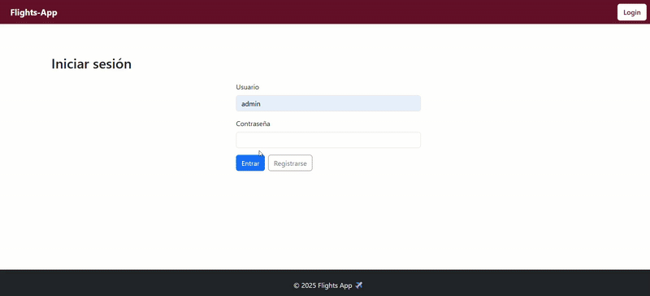
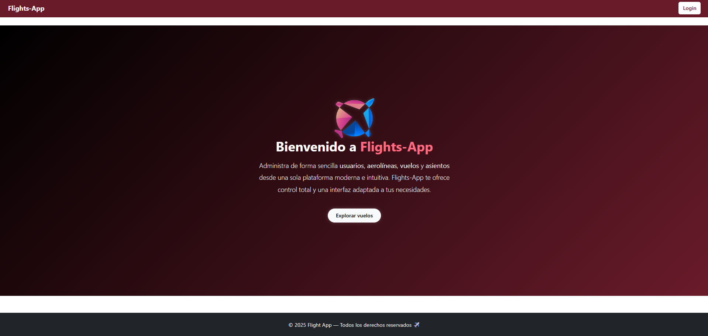
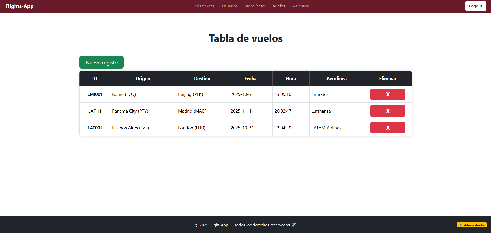
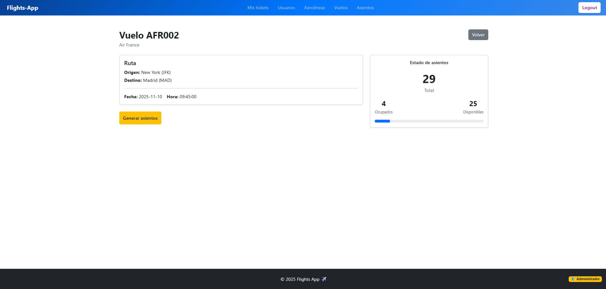
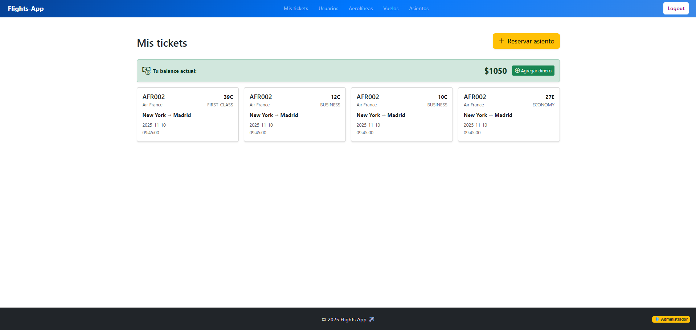
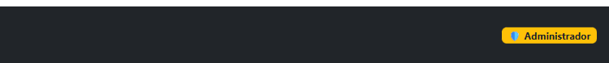

# ✈️ Flights App — Frontend


Interfaz de usuario para la aplicación Flights App, una plataforma para gestionar vuelos, reservas y usuarios.
Este proyecto consume el backend desarrollado con Spring Boot, protegiendo las rutas con roles y JWT, además de diversas funcionalidades.



---

## 🚀 Tecnologías utilizadas

- **React** (^19.1.1)
- **Vite** (dev server / build)
- **React Router**
- **Axios**
- **jwt-decode**
- **SweetAlert2**
- **ESLint**
- **Node.js & npm**


---

## ✨ Características y funcionalidades

### 🔐 Seguridad y autenticación
- Autenticación segura con **JWT**
- Roles de usuario: **Administrador** y **Usuario**
- Rutas protegidas según permisos

### 🛫 Gestión de vuelos y aerolíneas
- CRUD completo de **vuelos**, **usuarios**, **aerolíneas** y **asientos**
- Generación manual de **asientos aleatorios** para un vuelo
- **Reserva de asientos** disponibles en tiempo real
- **Cálculo automático del precio** según la clase del asiento y la **distancia** entre aeropuertos de origen y destino

### 💳 Operaciones de usuario
- Posibilidad de **agregar saldo** a la cuenta del usuario
- **Compra de asientos** según clase y disponibilidad

### 🧭 Navegación y experiencia de uso
- Navegación fluida e intuitiva entre rutas protegidas
- Página personalizada de **error o acceso denegado**
- Manejo de **mensajes de validación y errores** claros en cada operación


---

## 🖼️ Vista previa
### Página de inicio


### Listado de vuelos


### Detalle de un vuelo


### Tickets de un usuario


---

## 📁 Estructura del proyecto

```
/src
  /assets          
  /components
  /context     
  /pages  
  /routes         
  /services
  App.jsx
  index.css        
  main.jsx         
```

---

## ⚙️ Configuración y ejecución (local)

### 1. Clonar el repositorio

```bash
git clone https://github.com/tuusuario/flights-app-frontend.git

cd flights-app-frontend
```

### 2. Instalar dependencias

```bash
npm install
```

### 3. Ejecutar en modo desarrollo
```bash
npm run dev
```

La aplicación por defecto estará disponible en:
```http
http://localhost:5173
```

---

## 🤝 Conexión con el backend

* Repositorio backend: [flights-app-backend]("https://github.com/SantiagoSpina25/flights-app-backend")

* Asegúrate de iniciar el backend antes de usar el frontend.

* Ambos proyectos deben compartir la misma configuración de CORS y URL base.

---

## 🌐 Roles: Usuario y Administrador
En la aplicación existen dos roles principales: **usuario** y **administrador**.  
La diferencia clave es que el administrador puede acceder a endpoints protegidos y realizar acciones restringidas que los usuarios normales no pueden ejecutar.

En la interfaz, el rol del usuario se indica visualmente en el **footer**:  
si el usuario es administrador, aparecerá el siguiente distintivo:



En cambio, los usuarios estándar **no verán** los componentes o botones que permiten realizar acciones administrativas, como **crear una aerolínea, eliminar un usuario, generar asientos para un vuelo, etc**.

---

## 🔐 Autenticación (JWT)

- El sistema utiliza **JWT** (Bearer Token).

- Todas las rutas están protegidas, excepto:

  -  `/login`

  -  `/register`

- Al iniciar sesión, el token se guarda en el localStorage y se adjunta automáticamente en las peticiones a la API.

---

## 🧠 Próximas mejoras
- 🔍 Filtrado avanzado por ciudad o aerolínea  
- 📱 Versión responsive para móviles  
- ✈️ Vista del avion para reserva de asientos

---

## 👨‍💻 Autor

**Desarrollado por [Santiago Spina](https://github.com/SantiagoSpina25)**   
💡 Proyecto personal para practicar desarrollo fullstack con Spring Boot + React.

---

## 🛡️ Licencia

Este proyecto se distribuye bajo la licencia **MIT**.  
Puedes usarlo, modificarlo y compartirlo libremente.
